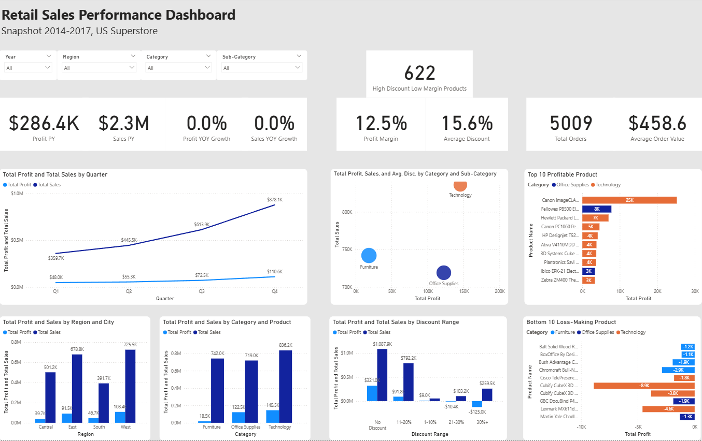

# Retail Superstore BI Dashboard
## Portfolio Project: Business Intelligence & Analytics

Proyek ini adalah dashboard Business Intelligence interaktif yang menganalisis data retail Superstore selama 4 tahun (2014–2017). Dashboard dibangun dengan Power BI menggunakan star schema, DAX measures, dan visualisasi multi-dimensi untuk mengidentifikasi tren penjualan, profitabilitas, dan dampak strategi diskon terhadap performa bisnis.

---

## Ringkasan Singkat

Dashboard menampilkan:
- **Executive KPI**: Total sales ($2.3M), profit ($286K), margin (12.5%), YOY growth trends
- **Trend Analysis**: Sales & profit bulanan dengan seasonality pattern (Q4 spike 40%)
- **Dimensi Bisnis**: Breakdown by category, region, product, dan discount range
- **Actionable Insights**: Produk loss-making, dampak diskon terhadap margin, rekomendasi pricing & inventory

---

## Dataset

**Sumber:** Kaggle Superstore Dataset  
**Link:** https://www.kaggle.com/datasets/vivek468/superstore-dataset-final/data  
**Lisensi:** CC0 Public Domain

| Attribute | Detail |
|-----------|--------|
| Jumlah Baris | 9,994 transaksi |
| Periode | 2014–2017 (4 tahun) |
| Geografis | United States (4 region) |
| Kategori Produk | 3 kategori, 17 sub-kategori |
| Fitur Utama | Sales, Profit, Discount, Category, Region, Order Date |

---

## Struktur Model Data

Dashboard menggunakan **star schema** sederhana untuk performa optimal dan maintainability:

**Relationship:**  
Calendar[Date] → Orders[Order Date] (One-to-Many)

**Key Components:**
- **Calendar Table**: Dimensi waktu lengkap dengan Year, Quarter, Month, Month-Year, Weekday
- **Discount Range Column**: Calculated column untuk grouping diskon (No Discount, 1-10%, 11-20%, 21-30%, >30%)
- **_Measures Table**: 11+ DAX measures untuk KPI dan analytics

---

## Fitur Dashboard

### 1. KPI Cards (Executive Summary)
Menampilkan metrik ringkas:
- Total Sales (tahun current)
- Total Profit
- Profit Margin %
- YOY Growth (Sales & Profit)
- Total Orders, Average Order Value
- Average Discount
- Count of High-Discount Low-Margin Products

### 2. Trend Analysis
**Line Chart: Sales & Profit by Year**
- Menunjukkan trajectory 2014–2017
- Double axis untuk perbandingan sales dan profit
- Insight: Sales naik konsisten tapi sales turun di 2015 lalu naik kembali

### 3. Category & Regional Breakdown
**Bar Charts:**
- Profit by Category dan Product (top performers)
- Sales by Region and City (market distribution)
- Insight: Technology tertinggi margin, West tertinggi margin

### 4. Discount Impact Analysis
**Clustered Column Chart: Profit & Sales by Discount Range**
- Breakdown: No Discount, 1-10%, 11-20%, 21-30%, >30%
- Insight: High discount (>20%) sering menurunkan profit meski naikkan sales

**High Discount Low Margin Products Card:**
- Count produk dengan diskon >20% tapi profit negatif
- Insight: 23 produk memerlukan review pricing

### 5. Product Deep Dive
**Top & Bottom 10 Products by Profit**
- Top 10: produk star (high profit, stable margin)
- Bottom 10: produk dengan loss atau margin minimal
- Action: Consider discontinue atau reprice bottom performers

### 6. Interactivity
- **Slicers**: Year, Region, Category untuk filtering multi-dimensi
- **Cross-Filtering**: Klik bar chart otomatis update visual lain
- **Drill-Down**: Year - Quarter - Month - Day di trend chart

---

## Temuan Utama

### Sales Turun 2.8% YOY di 2015
- Tren positif 2014–2016 tiba-tiba melemah di 2015
- **Action**: Investigasi faktor eksternal (kompetitor, market saturation, pricing)

### Diskon Tinggi ≠ Profit Tinggi
- 23 produk dengan diskon >20% masih rugi
- Diskon optimal tampak di range 1-10% (balance volume & margin)
- **Action**: Review kebijakan diskon—cap maksimal 15% untuk produk low-margin

### Technology Adalah Star Category
- Profit terbesar: $145K (30% total)
- Margin tertinggi: 17.4%
- Rekomendasi: Prioritas stok, promosi, dan margin protection

### Central Region Efisiensi Terbaik
- West tertinggi sales ($725k, 31% share) dan margin
- Central margin rendah namun sales memumpuni, efisiensi operasional lebih baik
- **Action**: Transfer best practices West ke Central

### Q4 Seasonal Spike 40%
- Pattern konsisten: Q4 (Oct–Dec) jauh lebih tinggi
- Butuh inventory build-up Sep–Nov
- Opportunity untuk margin management & flash sales

---

## Metrik & Definisi

| Metrik | Formula | Interpretasi |
|--------|---------|--------------|
| **Total Sales** | SUM(Orders[Sales]) | Revenue keseluruhan periode |
| **Total Profit** | SUM(Orders[Profit]) | Net profit setelah cost |
| **Profit Margin %** | Total Profit / Total Sales | Efisiensi margin (target >12%) |
| **Average Order Value** | Total Sales / Total Orders | Rata-rata nilai per order |
| **Average Discount** | AVERAGE(Orders[Discount]) | Rata-rata diskon applied (dalam %) |
| **YOY Growth** | (Current Year - Previous Year) / Previous Year | Growth rate year-over-year |

---

## Cara Menggunakan

### 1. Preview Dashboard
- Buka file `superstore_dashboard.pdf` untuk melihat dashboard versi static
- Lihat screenshot `superstore_dashboard.png` dan `superstore_scheme model.png` untuk gambaran cepat

### 2. Explore Interaktif (Offline)
- Download `superstore_dashboard.pbix`
- Buka dengan Power BI Desktop (gratis download dari Microsoft)
- Gunakan slicer Year/Region/Category untuk filter data
- Klik bar/chart untuk drill-down dan cross-filter

### 3. Validasi Data & Metodologi
- Baca `BI-methodology.md` untuk detail teknis tahapan
- Jalankan query di `queries.sql` untuk verify hasil aggregasi
- Bandingkan hasil SQL dengan hasil di dashboard

### 4. Customize & Extend
- Untuk extend: tambah slicer baru, visual baru, atau measure tambahan di Power BI
- Edit `.pbix` langsung atau gunakan Power BI Service untuk publish

---

## Tools & Requirements

**Untuk Preview/Baca:**
- Browser (baca markdown & PDF)
- PDF reader (untuk `superstore_dashboard.pdf`)

**Untuk Explore Interaktif:**
- Power BI Desktop (gratis, unduh dari https://powerbi.microsoft.com/downloads)
- Dataset CSV sudah include, tinggal open `.pbix` file

**Untuk Validasi Data:**
- SQL client (SQLite, DBeaver, pgAdmin, atau lainnya)
- Import `Sample - Superstore.csv` ke database
- Run query dari `queries.sql`

---

## Metodologi & Best Practices

Dashboard dibangun mengikuti best practice BI/DA:
- **Star Schema Design**: Scalable, efficient untuk aggregation & time intelligence
- **DAX Best Practices**: Measures terpisah dari dimension, CALCULATE untuk context override
- **Documentation**: Setiap step terdokumentasi untuk reproducibility
- **Data Validation**: Cross-checked dengan SQL untuk accuracy
- Lihat file `BI-methodology.md` untuk detail lengkap setiap tahapan.
